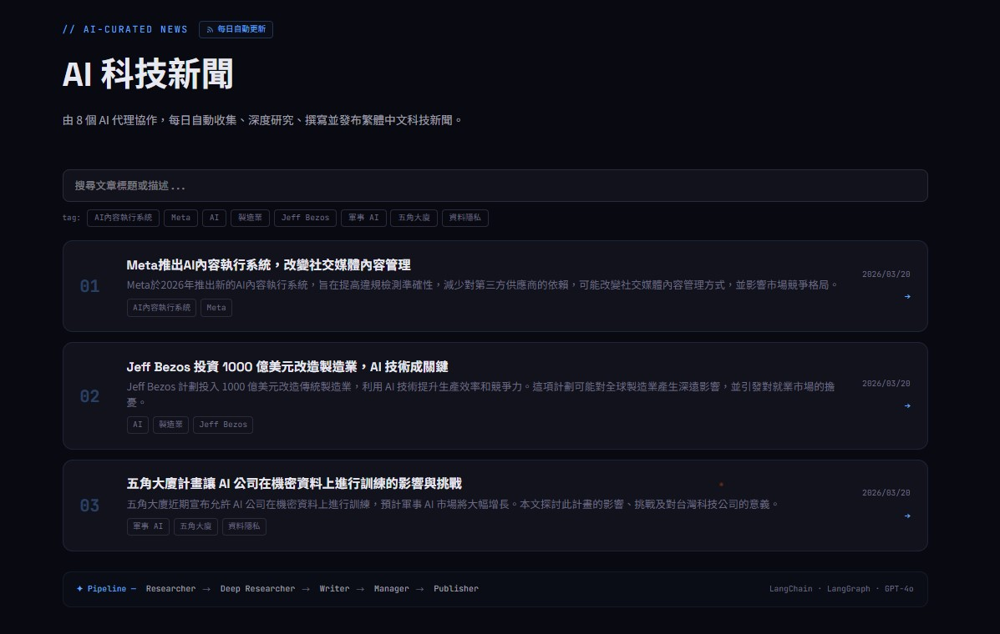
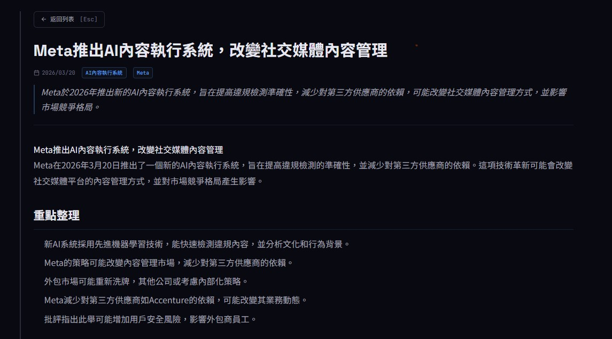
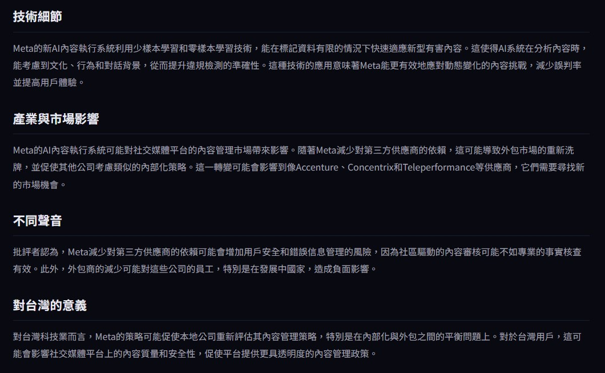
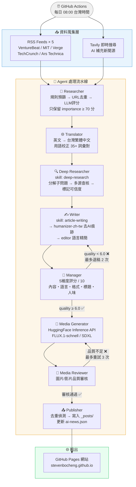
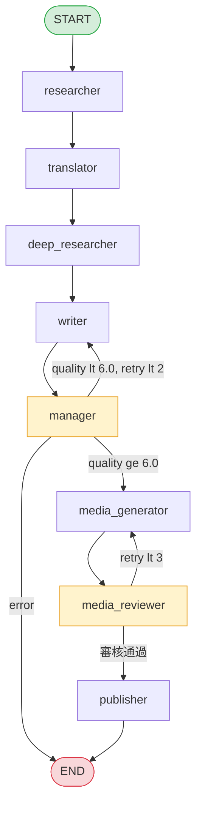

# 全自動 AI 科技新聞編輯室

**8 個 AI Agent 協作，每日從新聞蒐集到發布全程自動化，零人工介入。**

[](https://github.com/stevenbocheng/AI-NEWS-Teams/actions/workflows/daily-news.yml)
[](https://www.python.org/)
[](https://langchain-ai.github.io/langgraph/)
[](LICENSE)

🌐 **線上網站**：[stevenbocheng.github.io](https://stevenbocheng.github.io)

---

## 這個專案在做什麼

模擬一間真實的媒體編輯室，由 8 個各司其職的 AI Agent 組成，每天台灣時間 08:00 自動執行完整的新聞生產流水線：

- 從 5 個國際 AI 媒體 RSS + 即時搜尋中蒐集當日新聞
- 翻譯成台灣繁體中文（含用語校正）
- 深度查核事實、補充多方來源
- 撰寫 1500-2500 字長文，去除 AI 痕跡
- 品質評分把關（低於 6 分退稿重寫）
- 生成封面圖片與短影片
- 自動發布到 GitHub Pages 網站

### 網站截圖



<details>
<summary>文章內容截圖（展開）</summary>




</details>

---

## Agent 架構圖



---

## 技術設計亮點

### Skill-based Agent 設計

每個 Agent 都有對應的 **Skill 規範文件**（`.agents/skills/`），定義職責、禁止行為與輸出標準，讓 AI 的行為可預期、可替換、可測試。

| Agent | 使用的 Skill | 核心職責 |
|-------|-------------|---------|
| Deep Researcher | `deep-research` | 分解子問題、標記來源可信度、區分事實/推論 |
| Writer（第1步） | `article-writing` | 具體數字開場、禁用炒作詞彙、直接務實語氣 |
| Writer（第2步） | `humanizer-zh-tw` | 偵測並修正 24 種 AI 寫作模式 |
| Writer（第3步） | `editor` | Copy Editing + Line Editing，精簡冗詞 |

**humanizer-zh-tw** 基於維基百科「AI 寫作特徵」研究，針對性修正：
- 誇大象徵意義（「標誌著關鍵轉折點」）
- 模糊歸因（「業界專家認為」）
- 三段式法則、破折號濫用、AI 詞彙（「至關重要」「彰顯」）

### LangGraph 狀態機路由

使用 LangGraph 的 `StateGraph` 實現**有向圖 Agent 路由**，支援條件分支與迴圈。



**條件路由的實作：**

```python
# 條件函式 1：Manager 審核後的路由
def should_revise(state: NewsState) -> str:
    if state.get("error"):
        return END                          # 有錯誤 → 直接終止
    if state["quality_score"] < 6.0 and state["revision_count"] < 2:
        return "writer"                     # 品質不足 → 退稿重寫
    return "media_generator"               # 通過 → 繼續媒體生成

# 條件函式 2：Media Reviewer 審核後的路由
def should_regenerate_media(state: NewsState) -> str:
    if not img_ok and state["media_revision_count"] < 3:
        return "media_generator"            # 品質不足 → 重新生成
    return "publisher"                     # 通過 → 發布

# 註冊到 Graph
graph.add_conditional_edges("manager", should_revise,
    {"writer": "writer", "media_generator": "media_generator", END: END})
graph.add_conditional_edges("media_reviewer", should_regenerate_media,
    {"media_generator": "media_generator", "publisher": "publisher"})
```

所有 Agent 共享同一個 `NewsState` TypedDict（15 個欄位），每個 Agent **只讀取需要的欄位、只寫入負責的欄位**，完全解耦，任一節點可獨立替換。

### 智慧成本控制

```
複雜任務（創意寫作、深度分析）→ gpt-4o
簡單任務（翻譯、審核、校對）  → gpt-4o-mini（便宜約 15 倍）
每次最多發布 3 篇              → 防止費用失控
規則預篩在 LLM 之前執行        → 比 LLM 快 100 倍，先砍掉不相關內容
```

### 多工具串接

| 工具 | 用途 | 整合方式 |
|------|------|---------|
| **Tavily API** | 即時搜尋（專為 LLM 設計） | LangChain TavilySearchResults |
| **OpenAI API** | 主要 LLM | LangChain ChatOpenAI |
| **HuggingFace Inference** | 圖片/影片生成 | REST API，可選（不設定則跳過） |
| **RSS Feeds × 5** | 新聞來源 | requests + xml.etree 解析 |
| **GitHub Actions** | 排程與自動部署 | Cron + git push |
| **Loguru** | 結構化日誌 | 每日輪轉，30 天保留 |

---

## 新聞來源

| 媒體 | 特色 |
|------|------|
| VentureBeat AI | 商業 AI 新聞，消息快 |
| MIT Technology Review | 學術深度，1899 年創刊 |
| The Verge AI | 平衡可讀性與專業度 |
| TechCrunch AI | 新創融資與產品發布 |
| Ars Technica | 技術細節最紮實 |
| Tavily 即時搜尋 | 補抓 RSS 漏掉的台灣視角新聞 |

每個來源最多抓 10 則 → 規則過濾 → URL 去重 → LLM 評分（≥70 分）→ 最終 3-5 則進入發布流程。

---

## 技術棧

```
核心框架    LangChain 0.3+  ·  LangGraph 0.2+
LLM         OpenAI GPT-4o  ·  GPT-4o-mini
搜尋        Tavily API
媒體生成    HuggingFace Inference（FLUX.1-schnell · SDXL · SVD）
資料驗證    Pydantic 2.0+
自動部署    GitHub Actions  ·  GitPython 3.1+
日誌        Loguru
語言        Python 3.11
```

---

## 本地開發

```bash
# 1. 複製專案
git clone https://github.com/stevenbocheng/AI-NEWS-Teams.git
cd AI-NEWS-Teams

# 2. 建立虛擬環境
python -m venv venv
source venv/bin/activate  # Windows: venv\Scripts\activate

# 3. 安裝依賴
pip install -r requirements.txt

# 4. 設定環境變數
cp .env.example .env
# 編輯 .env，填入以下金鑰：
```

```env
OPENAI_API_KEY=sk-...
TAVILY_API_KEY=tvly-...
GITHUB_REPO=your-username/your-repo
HF_TOKEN=hf_...          # 選填，不填則跳過媒體生成
```

```bash
# 5. 執行
python src/main.py
```

執行日誌會寫到 `output/logs/`，生成的文章在 `_posts/`。

---

## 專案結構

```
├── src/
│   ├── agents/          # 8 個 Agent 實作
│   │   ├── researcher.py
│   │   ├── translator.py
│   │   ├── deep_researcher.py
│   │   ├── writer.py    # 整合 3 個 Skill
│   │   ├── manager.py   # 5 維度評分
│   │   ├── media_generator.py
│   │   └── media_reviewer.py
│   ├── graph/
│   │   └── workflow.py  # LangGraph 狀態機定義
│   ├── tools/
│   │   ├── search.py    # Tavily 封裝
│   │   └── publisher.py # 發布與去重邏輯
│   └── utils/
│       ├── formatter.py       # Jekyll front matter 生成
│       └── language_filter.py # 台灣用語替換（35+ 詞彙對）
├── .agents/skills/      # Skill 規範文件
│   ├── article-writing/
│   ├── humanizer-zh-tw/
│   ├── editor/
│   └── deep-research/
├── config/
│   └── settings.py      # 環境變數管理
├── .github/workflows/
│   └── daily-news.yml   # GitHub Actions 排程
├── _posts/              # 發布的文章（Jekyll 格式）
├── _data/
│   └── published_log.json  # 去重資料庫
└── output/
    └── logs/            # 執行日誌（每日輪轉）
```

---

## 設計原則

**單一職責**：每個 Agent 只負責一件事，只讀取需要的 State 欄位，只寫入負責的欄位。

**可替換性**：想換掉任何一個 Agent 或 Skill，不影響其他部分。

**優雅降級**：`HF_TOKEN` 未設定時，媒體生成步驟自動跳過，系統不崩潰。

**防禦性設計**：每個 LLM 輸出都有 JSON 解析的 fallback，單篇文章失敗不影響整批次。

---

## 精選專案摘要（個人網站用）

### 中文版

8 個 AI 代理以 LangGraph StateGraph 串接，每日台灣時間 08:00 由 GitHub Actions 自動觸發，執行從新聞蒐集到發布的完整流水線，無需人工介入。

**設計亮點：**

- **條件路由**：Manager Agent 以 5 個維度（內容品質、語言品質、格式、標題、人味）對草稿評分，低於 6.0 分退回 Writer 重寫，最多退稿 2 次後強制繼續，防止無限迴圈。
- **三角色寫作流程**：Writer 依序執行 article-writing（事實開場、禁用炒作詞）、humanizer-zh-tw（去除 24 種 AI 寫作模式）、editor（主動語態、精簡冗詞）三個 Prompt 角色，均基於開源框架針對台灣繁體中文場景重新調整。
- **共享狀態設計**：15 個欄位的 `NewsState` TypedDict 跨所有 Agent 共用，每個 Agent 只讀寫自己負責的欄位，任一節點可獨立替換不影響其他部分。
- **雙模型成本控制**：GPT-4o 負責創意寫作與深度分析，GPT-4o-mini 負責翻譯、評分、校對等重複性任務，每次最多發布 3 篇。
- **優雅降級**：HuggingFace Token 未設定時自動跳過媒體生成，系統正常運行不崩潰。

### 英文版（Resume / Portfolio）

**AI News Automation System** · Python · LangGraph · OpenAI · Tavily · HuggingFace · GitHub Actions

**System Design**: 8 AI Agents run a daily news pipeline — sourcing, translating, fact-checking, writing, reviewing, publishing — without anyone touching it. LangGraph handles the execution order with a shared `NewsState` TypedDict (15 fields). Low-scoring articles get sent back to the Writer for a rewrite, up to twice.

**Writing Quality Control**: Every article passes through three AI roles in sequence: write the draft, strip AI-sounding language (24 detected patterns), tighten the prose. A Manager Agent then scores across 5 dimensions. Below 6.0, it doesn't publish. Role behavior is adapted from open-source prompt frameworks, adjusted for Traditional Chinese.

**Tool Integration**: Connected 4 services: Tavily (web search), HuggingFace (cover images and clips), OpenAI, and GitHub Actions for daily scheduling. Writing uses GPT-4o, review uses GPT-4o-mini. Media generation is skipped gracefully when the HuggingFace token is absent.
